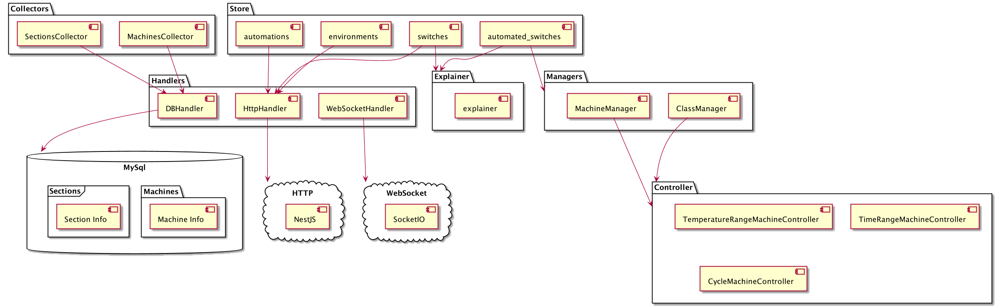
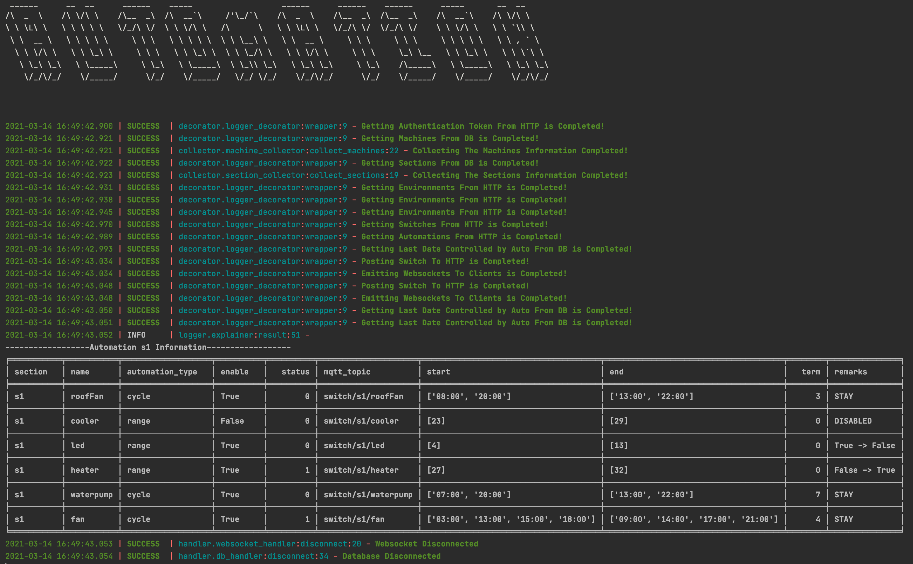

# plantpoint-automation
Automation for SmartFarm System


### Installation

To install related packages, write a command line below

```bash
pip3 install -r requirements.txt
```


### Prerequisite

There should be secret.py in reference directory in this project. The contents should be like below

```python
# This file should be plantpoint-automation/reference/secret.py file.

# These username and password are for http authentication token.
# If you don't need these, could delete.
USERNAME = "USERNAME"
PASSWORD = "USER_PASSWORD"

# This is Database informations.
DB_HOST = 'localhost'
DB_USER = 'root'
DB_PASSWORD = 'DB_PASSWORD'

# This is for Http Communication like backend server ip.
IP = 'localhost'
```


### Project Diagram




#### Preparation

Handlers : This objects are helper objects for collecting data or sending api or web sockets.

Collector : Read data from Mysql database. The data are Sections and Machines.

Store : Read Data from Backend through http api. This store object would be used in controlling machines and automations.

Manager : Classify and find proper object or set the prepared data on the machines objects.


#### Controller

Controller : Controllers are divided into TemperatureRange, TimeRange, Cycle machines. With these prepared machine object, controllers set the right machine power.


#### Logger

Explainer : Log the results into files and terminal.



